# XXX Project Status Update [^footnote1] - Feb 23, 2021

> Project Health **7.0/10** [^cal]

## Milestones

> Legend: [✔:Completed, 🔵:Project Plan V3, 🟢:Project Plan V5, ⚠:Warning]

```mermaid
gantt
    dateFormat  YYYY-MM-DD
    title       Milestone status | Delivery status | Gantt
    excludes    weekends
    todayMarker stroke-width:5px,stroke:#0f0,opacity:0.5
    %% (`excludes` accepts specific dates in YYYY-MM-DD format, days of the week ("sunday") or "weekends", but not the word "weekdays"; task status: done, active, crit.)

    section M1
    TC387 CDD | ⚠ :m1, 2020-09-17,2020-11-30
    Revised :crit, 2020-09-17,2021-02-24
    section M2
    SPC574S CDD | ⚠ :m2, 2020-12-21,2021-02-25
    Revised part A :crit, 2021-01-20,2021-03-15
    Revised part BQ79616 :crit, 2021-02-15,2021-03-20
    section M3
    TC387 Bootloader| ⚠ :m3, 2020-12-28,2021-02-19
    Revised :crit, 2021-01-10,2021-03-11
    section M4
    SPC574S CDD | ⚠ :m4, 2021-02-11,2021-03-29
    Revised :crit,2021-03-20,2021-04-15
    section M5
    TC387 Bootloader | ⚠ :m5, 2021-02-01,2021-03-31
    Revised :crit, 2021-02-25,2021-03-26
    section M6
    TC387 Non-Safety Module| ⚠ :m6, 2021-03-23,2021-04-08
    Revised :crit,  2021-02-20,2021-04-15
    section M7
    TC387 Safety Module | ⚠ :m7, 2021-03-29,2021-04-14
    Revised :crit, 2021-03-20,2021-04-15
    section M8
    TC387 Safety Documents | ⚠ :m8, 2020-12-18,2021-01-18
    Revised :crit,2021-02-01,2021-04-12
    section M9
    TC387 Bootloader| ⚠ :m9, 2021-03-25,2021-04-08
    Revised :crit, 2021-03-15,2021-04-15

```

Detail project status update on this Excel sheet -> [View Source](https://www.bosch.com).

## Issues

| Status | Issue | Pending at (Resolved at) | Due Date |
| ---- | ---- | ---- | ---- |
| ⚠ | Example | Someone | Feb 22 |
| ✔ | Example | Resolved at Feb 21 | Feb 22 |
| 🟡 | Example | Someone | Feb 22 |

## Customer Feedback

| Status | Issue |
| ---- | ---- |
| + | Example |
| - | Example |

[^footnote1]: Auto-Generated Project Status Report. [View Source](https://www.bosch.com)
[^cal]: Calaulation method: Health = 10 - milestones(60%, miss milestone => -1) - issues(20%, overdue => -1) - customer feedback(20%, +/- => +/- 1)
