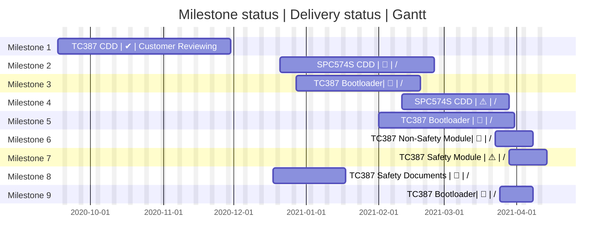
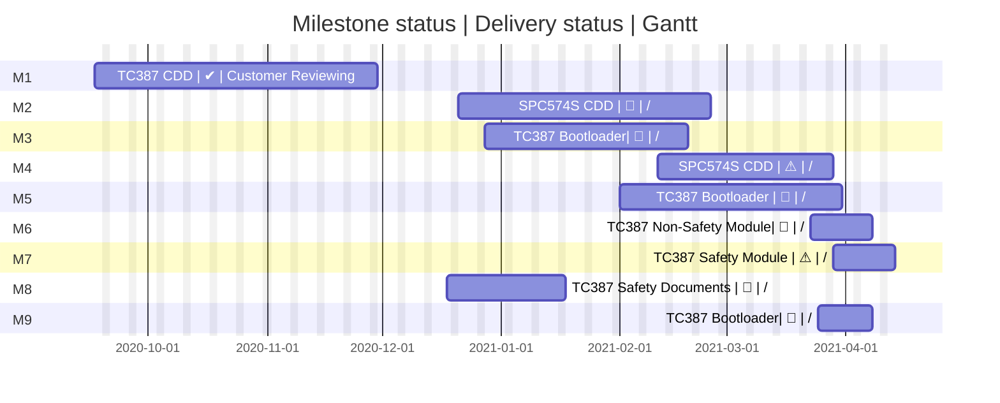
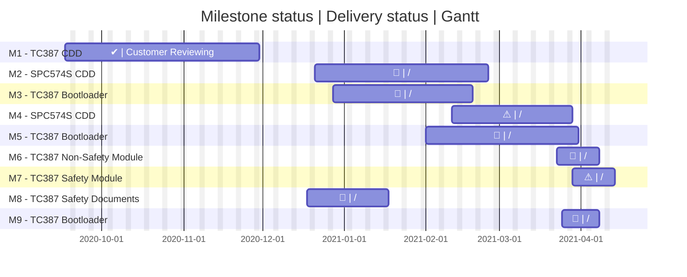

> Gantt 1

```mermaid
gantt
    dateFormat  YYYY-MM-DD
    title       Milestone status | Delivery status | Gantt
    excludes    weekends
    todayMarker stroke-width:5px,stroke:#0f0,opacity:0.5
    %% (`excludes` accepts specific dates in YYYY-MM-DD format, days of the week ("sunday") or "weekends", but not the word "weekdays"; task status: done, active, crit.)

    section Milestone 1
    TC387 CDD | ✔ | Customer Reviewing :m1, 2020-09-17,2020-11-30
    section Milestone 2
    SPC574S CDD | 🔴 | / :m2, 2020-12-21,2021-02-25
    section Milestone 3
    TC387 Bootloader| 🔴 | / :m3, 2020-12-28,2021-02-19
    section Milestone 4
    SPC574S CDD | ⚠ | / :m4, 2021-02-11,2021-03-29
    section Milestone 5
    TC387 Bootloader | 🔴 | / :m5, 2021-02-01,2021-03-31
    section Milestone 6
    TC387 Non-Safety Module| 🔴 | / :m6, 2021-03-23,2021-04-08
    section Milestone 7
    TC387 Safety Module | ⚠ | / :m7, 2021-03-29,2021-04-14
    section Milestone 8
    TC387 Safety Documents | 🔴 | / :m8, 2020-12-18,2021-01-18
    section Milestone 9
    TC387 Bootloader| 🔴 | / :m9, 2021-03-25,2021-04-08

```

> Gantt 2

```mermaid
gantt
    dateFormat  YYYY-MM-DD
    title       Milestone status | Delivery status | Gantt
    excludes    weekends
    todayMarker stroke-width:5px,stroke:#0f0,opacity:0.5
    %% (`excludes` accepts specific dates in YYYY-MM-DD format, days of the week ("sunday") or "weekends", but not the word "weekdays"; task status: done, active, crit.)

    section M1
    TC387 CDD | ✔ | Customer Reviewing :m1, 2020-09-17,2020-11-30
    section M2
    SPC574S CDD | 🔴 | / :m2, 2020-12-21,2021-02-25
    section M3
    TC387 Bootloader| 🔴 | / :m3, 2020-12-28,2021-02-19
    section M4
    SPC574S CDD | ⚠ | / :m4, 2021-02-11,2021-03-29
    section M5
    TC387 Bootloader | 🔴 | / :m5, 2021-02-01,2021-03-31
    section M6
    TC387 Non-Safety Module| 🔴 | / :m6, 2021-03-23,2021-04-08
    section M7
    TC387 Safety Module | ⚠ | / :m7, 2021-03-29,2021-04-14
    section M8
    TC387 Safety Documents | 🔴 | / :m8, 2020-12-18,2021-01-18
    section M9
    TC387 Bootloader| 🔴 | / :m9, 2021-03-25,2021-04-08

```
> Gantt 3

```mermaid
gantt
    dateFormat  YYYY-MM-DD
    title       Milestone status | Delivery status | Gantt
    excludes    weekends
    todayMarker stroke-width:5px,stroke:#0f0,opacity:0.5
    %% (`excludes` accepts specific dates in YYYY-MM-DD format, days of the week ("sunday") or "weekends", but not the word "weekdays"; task status: done, active, crit.)

    section M1 - TC387 CDD 
    ✔ | Customer Reviewing :m1, 2020-09-17,2020-11-30
    section M2 - SPC574S CDD
    🔴 | / :m2, 2020-12-21,2021-02-25
    section M3 - TC387 Bootloader
    🔴 | / :m3, 2020-12-28,2021-02-19
    section M4 - SPC574S CDD
    ⚠ | / :m4, 2021-02-11,2021-03-29
    section M5 - TC387 Bootloader
    🔴 | / :m5, 2021-02-01,2021-03-31
    section M6 - TC387 Non-Safety Module
    🔴 | / :m6, 2021-03-23,2021-04-08
    section M7 - TC387 Safety Module
    ⚠ | / :m7, 2021-03-29,2021-04-14
    section M8 - TC387 Safety Documents
    🔴 | / :m8, 2020-12-18,2021-01-18
    section M9 - TC387 Bootloader
    🔴 | / :m9, 2021-03-25,2021-04-08

```